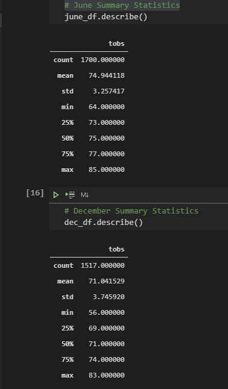

# Surfs Up Surf & Ice Cream Shop

## Project Overview

Potential business partner and investor was looking for some further analysis to see if the surf and ice cream show is sustainable all year round. Temperature data for the months of June and December were requested. The data is in a SQLite file and using Jupyter Lab and VS Code was to connect to the database a write queries to extract the temperatures. Using Pandas was able to create a dataframe and used the describe function to get statistics on the variable.

## Resources

- Data Source: hawaii.sqlite
- Software: Jupyter Lab, Visual Code Studio 1.49.3, Atom 1.51.0 x64

## Results

1. The mean temperature for the month of June was 74.9 degrees and December's was 71. Basically 4 degrees difference.

2. The max temperature for the month of June was 85 degrees and December's was 83. Only 2 degrees difference.

3. The minimum temperature for the month of June was 64 degrees and December's was 56. An 8 degree difference.

## Summary
Ay first glace the summary statistics for both June and December show that there is a difference in the average temperatures yet I am not sure enough to say that people wouldn't still eat ice cream in cooler temperatures. If people are travelling in December from a cold, snow covered area to the warmer Hawaii, I am sure they would still eat ice cream and surf. Although the minimum temperatures are lower in December, there are still maximum temperatures in the 80s. That is promising.

Another query that could be done is by first figuring out which weather station is closest to the shop and then filtering the data to only show temperatures for that weather station. It would also valuable to filter the precipitation for that station in June and December.
